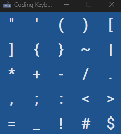

# Coding Keyboard

---

Designed to provide convenience for beginners to code, this application makes it easier for beginners to type characters
that are hard to find on keyboards.

### Usage

---

install required libraries and run

 ```
 pip install -r requirements.txt
 python ./main.pyw
 ```

### Screenshots

---




### Features

---

Any key can be removed or added with the list in the keys.json file
